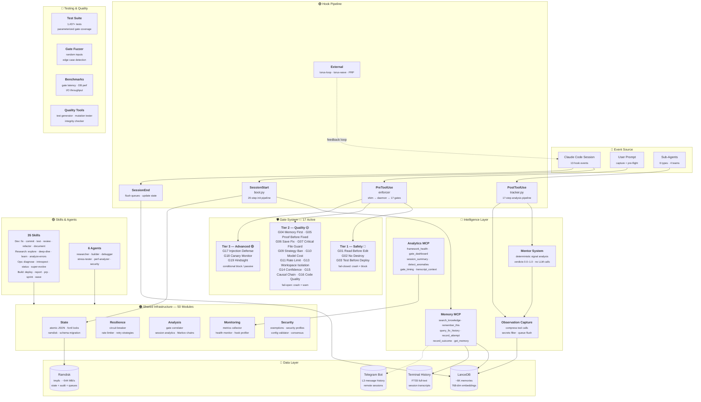

<p align="center">
  <h1 align="center">🔄 Torus Framework</h1>
  <p align="center">
    <em>A self-evolving quality framework for <a href="https://docs.anthropic.com/en/docs/claude-code">Claude Code</a></em>
  </p>
  <p align="center">
    <a href="https://github.com/OZmasterAI/Torus-Framework/blob/main/LICENSE"></a>
    
    
    
  </p>
</p>

---

Torus wraps Claude Code with persistent memory, 19 quality gates, automated hooks, and structured workflows — turning it from a stateless CLI into a disciplined, self-improving development partner.

> **119 Python files** · **~50K lines** · **17 active gates** · **33 skills** · **6 specialized agents** · **2 MCP servers**

---

## ⚡ Quick Start

```bash
# 1. Clone into your Claude Code config directory
git clone https://github.com/OZmasterAI/Torus-Framework.git ~/.claude

# 2. Install Python dependencies
pip install -r ~/.claude/hooks/requirements.txt

# 3. Copy config templates
cp ~/.claude/config.example.json ~/.claude/config.json
cp ~/.claude/mcp.example.json ~/.claude/mcp.json

# 4. Edit mcp.json — replace $HOME with your actual home directory path

# 5. Set up the ramdisk (persistent tmpfs for fast state I/O)
bash ~/.claude/hooks/setup_ramdisk.sh

# 6. Launch Claude Code
cd ~/.claude && claude
```

On first launch, SessionStart hooks bootstrap the enforcer daemon, load memory, and initialize state.

---

## 🎯 What It Does

| Feature | Description |
|---------|-------------|
| **19 Quality Gates** | Mechanical enforcement — read before edit, test before deploy, memory-first, no-destroy, injection defense, and more |
| **Persistent Memory** | LanceDB with semantic search, causal fix tracking, tag indexing, and auto-captured observations (~1,488 memories) |
| **Hook Pipeline** | 12 lifecycle events — SessionStart, PreToolUse, PostToolUse, Stop, SubagentStart, PreCompact, and more |
| **33 Skills** | Slash commands — `/commit`, `/benchmark`, `/security-scan`, `/super-evolve`, `/introspect`, `/prp`, and more |
| **6 Agents** | builder, debugger, researcher, security, perf-analyzer, stress-tester — with delegation rules |
| **2 MCP Servers** | Memory (6 tools) + Analytics (10 tools), accessible as native Claude tools |
| **Enforcer Daemon** | Persistent UDS server — gate checks in ~5ms instead of ~134ms inline |
| **Mentor System** | Real-time quality scoring (0.0–1.0) with deterministic verdicts, no LLM calls |
| **Session Continuity** | HANDOFF.md + LIVE_STATE.json carry context across sessions automatically |
| **Telegram Bot** | Remote Claude sessions via Telegram with message mirroring |

---

## 🏗️ Architecture



For the full architecture reference, see **[ARCHITECTURE.md](ARCHITECTURE.md)**.

---

## 🛡️ Gate System

Three tiers of enforcement — safety gates fail-closed, quality gates fail-open:

<details>
<summary><strong>Tier 1 — Safety (fail-closed: crash = block)</strong></summary>

| Gate | Name | Purpose |
|------|------|---------|
| 1 | Read Before Edit | Must read a file before editing it |
| 2 | No Destroy | Blocks `rm -rf`, `DROP TABLE`, force push, `reset --hard` (47 patterns) |
| 3 | Test Before Deploy | Must run tests before deploying |

</details>

<details>
<summary><strong>Tier 2 — Quality (fail-open: crash = warn)</strong></summary>

| Gate | Name | Purpose |
|------|------|---------|
| 4 | Memory First | Blocks edits if memory not queried in last 5 min |
| 5 | Proof Before Fixed | Blocks edits to new files when 3+ unverified |
| 6 | Save To Memory | Warns then blocks when fixes aren't saved |
| 7 | Critical File Guard | Extra checks for high-risk files |
| 9 | Strategy Ban | Blocks strategies that failed 3+ times |
| 10 | Model Cost Guard | Enforces model selection within budget tier |
| 11 | Rate Limit | Blocks >60 tool calls/min |
| 13 | Workspace Isolation | Prevents concurrent file edits across agents |
| 14 | Confidence Check | Progressive warning → block on unverified edits |
| 15 | Causal Chain | Blocks edits after test failure until fix history queried |
| 16 | Code Quality | Catches debug prints, hardcoded secrets, broad excepts |

</details>

<details>
<summary><strong>Tier 3 — Advanced</strong></summary>

| Gate | Name | Purpose |
|------|------|---------|
| 17 | Injection Defense | Detects prompt injection (base64, ROT13, homoglyphs, zero-width) |
| 18 | Canary Monitor | Passive monitoring — never blocks. Detects bursts and anomalies |
| 19 | Hindsight | Reads mentor signals; blocks on sustained poor quality |

</details>

---

## 🧠 Memory System

Four-tier memory architecture with automatic cascade:

```
L1: LanceDB (curated, semantic search, ~6K memories)
 └── L2: Terminal History (FTS5 full-text, indexed session transcripts)
      └── L0: Raw Transcripts (JSONL session files, time-windowed retrieval)
           └── L3: Telegram (FTS5, message history fallback)
```

L0 activates when `transcript_l0: true` in config — pulls raw conversation windows from matching sessions when L1+L2 results are weak (< 0.3 relevance).

| Tool | Purpose |
|------|---------|
| `search_knowledge(query)` | Semantic search across 8 modes with L2/L0/L3 cascade |
| `remember_this(content)` | Save memory with automatic dedup (cosine > 0.85) |
| `get_memory(id)` | Retrieve full memory by ID |
| `query_fix_history(error)` | Find what strategies worked or failed |
| `record_attempt(error, strategy)` | Log a fix attempt → returns chain_id |
| `record_outcome(chain_id, result)` | Log whether the fix succeeded or failed |

**Causal chain workflow:** `query_fix_history` → `record_attempt` → fix + test → `record_outcome` → `remember_this`

---

## 📂 Project Structure

```
~/.claude/
├── CLAUDE.md                # Rules injected into every Claude session
├── config.json              # Feature toggles (from config.example.json)
├── mcp.json                 # MCP server registration (from mcp.example.json)
├── settings.json            # Hook registrations and permissions
├── hooks/
│   ├── enforcer.py          # Gate engine (17 active gates)
│   ├── enforcer_daemon.py   # UDS daemon for low-latency gate checks (~5ms)
│   ├── memory_server.py     # MCP server: LanceDB memory + semantic search
│   ├── analytics_server.py  # MCP server: session analytics + gate dashboard
│   ├── gates/               # Individual gate implementations
│   ├── shared/              # 49 shared modules (state, audit, circuit breaker, etc.)
│   ├── tracker.py           # PostToolUse pipeline (mentor, observations, auto-remember)
│   └── boot.py              # SessionStart orchestrator
├── skills/                  # 33 slash commands (/commit, /benchmark, etc.)
├── agents/                  # 6 specialized agent definitions
├── integrations/
│   ├── telegram-bot/        # Remote Claude via Telegram
│   └── terminal-history/    # Session transcript indexer
└── scripts/                 # Orchestration (torus-loop, torus-wave, cleanup)
```

---

## 📚 Documentation

| Document | Description |
|----------|-------------|
| **[USAGE_GUIDE.md](USAGE_GUIDE.md)** | Full usage guide — sessions, gates, memory, skills, workflows |
| **[ARCHITECTURE.md](ARCHITECTURE.md)** | Deep technical reference — all components, data flow, config options |
| **[CLAUDE.md](CLAUDE.md)** | The rules file injected into every Claude session |

---

## ⚙️ Configuration

Copy the example files and customize:

| Template | Target | Purpose |
|----------|--------|---------|
| `config.example.json` | `config.json` | Feature toggles (gates, memory, mentor, telegram) |
| `mcp.example.json` | `mcp.json` | MCP server paths (memory + analytics) |

<details>
<summary><strong>Optional: Telegram Bot</strong></summary>

```bash
pip install -r ~/.claude/integrations/telegram-bot/requirements.txt
cp ~/.claude/integrations/telegram-bot/config.example.json \
   ~/.claude/integrations/telegram-bot/config.json
# Edit config.json with your bot token and allowed user IDs
python3 ~/.claude/integrations/telegram-bot/bot.py
```

</details>

<details>
<summary><strong>Optional: Web Skill Dependencies</strong></summary>

```bash
pip install -r ~/.claude/skills/web/requirements.txt
```

</details>

---

## 🔧 Prerequisites

- [Claude Code](https://docs.anthropic.com/en/docs/claude-code) CLI installed
- Python 3.10+
- Linux with systemd (for ramdisk state storage)

---

## 📄 License

[Apache-2.0](LICENSE)
